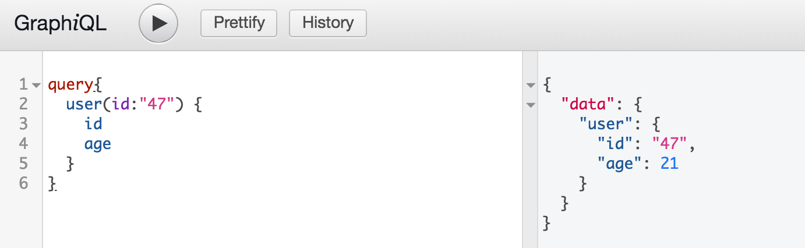

# hello GraphQL 
GraphQL 을 처음 시작하는 방법

```bash
$ npm install
```

```bash
$ npm start
```

### graphql
```graphql
query{
  user(id:"47") {
    id
    age
  }
}
````

### result
```json
{
  "data": {
    "user": {
      "id": "47",
      "age": 21
    }
  }
}
```

