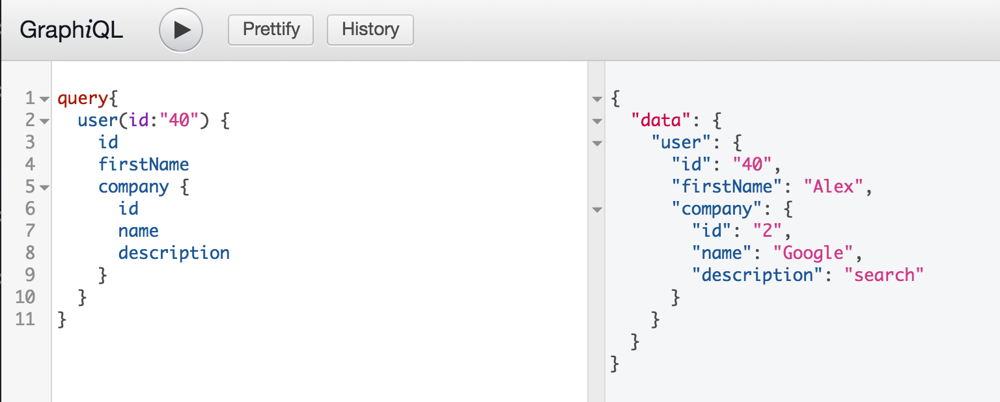
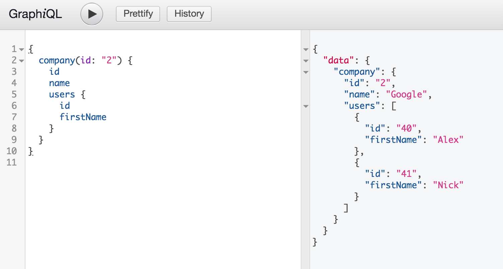
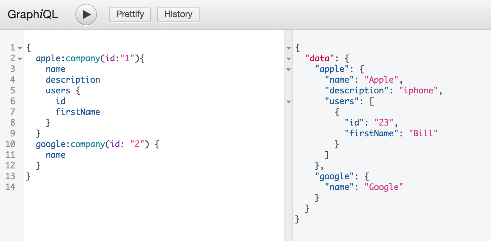

# GraphQL 에서 여러 데이터 가져오기

예로 들어 회사 데이터가 2개 이상이 있을경우 사용방법



### Example DB
```json
"companies": [
    {
        "id": "1",
        "name": "Apple",
        "description": "iphone"
    },
    {
        "id": "2",
        "name": "Google",
        "description": "search"
    }
]
```
## 2개 회사 데이터 가져오기
기존에 알고 있는 방법대로 아래처럼 작성한다면, 바로 에러 메시지가 발생합니다.
이유는 `return` 받는 데이터에 `field name`이 `company` 로 받아야하는데,
이게 충돌나기 때문입니다.
`json object`에서는 동일한 `field name`을 가질 수 없기 때문입니다.
```graphql
# 이렇게 작성한다면 바로 실패 메시지가 발생할 것입니다.
{
  company(id: "1") {
    id
    name
    description
  }
  company(id: "2") {
    id
    name
    description
  }
}
```
에러 메시지
```json
{
  "errors": [
    {
      "message": "Fields \"company\" conflict because they have differing arguments. Use different aliases on the fields to fetch both if this was intentional.",
      "locations": [
        {
          "line": 2,
          "column": 3
        },
        {
          "line": 7,
          "column": 3
        }
      ]
    }
  ]
}
```

이를 해결하기 위한 방법으로 `company`라는 `field name`을 다른 것으로 대체가 가능합니다. `company` 라는 `SchemaType`명을 선택한 상태에서 앞에 원하는 `field name`을 작성해주면 됩니다.

`원하는필드명`:`스키마타입명`(`Argument명`:`Argument값`)

```graphql
{
  apple:company(id: "1") {
    id
    name
    description
  }
  google:company(id: "2") {
    id
    name
    description
  }
}
```
결과
```json
{
  "data": {
    "apple": {
      "id": "1",
      "name": "Apple",
      "description": "iphone"
    },
    "google": {
      "id": "2",
      "name": "Google",
      "description": "search"
    }
  }
}
```

